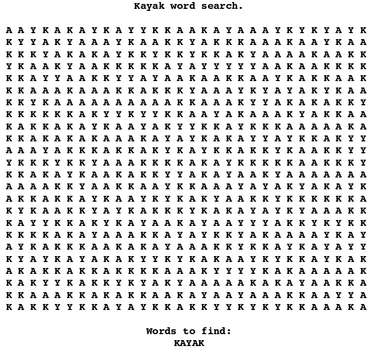
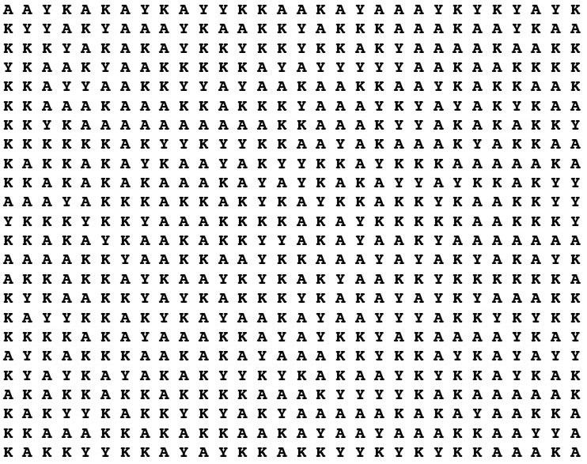
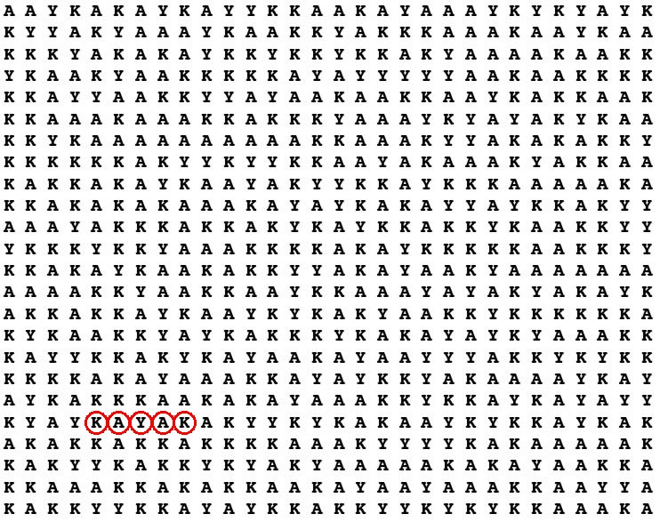

The Kayak puzzle
================

So I saw this funny crossword on the internet that was composed only of letters **K**, **A** and **Y**.
The point of the crossword was to find the word **KAYAK**. Seemingly impossible and the author disclosed
that the word **KAYAK** appears in the glyphs matrix only once.

After I spent a couple of minutes solving the puzzle I figured it would be interesting to write
a program to solve the puzzle for me, since I've never done any [OCR](http://en.wikipedia.org/wiki/Optical_character_recognition) before, and wanted to try it.

How did I proceed
=================

The very first step was to remove the title and help text from the crossword so it could be processed
by the program without distractions. I've done this using Mac OS X's Preview.app. Here's the image after cropping:

Then, using [OpenCV](http://opencv.org/) I separated individual glyphs into a matrix, storing each glyph on index
according to its possition in the glyphs matrix on the image.

After that, I initialized [Artificial Neural Network](http://en.wikipedia.org/wiki/Artificial_neural_network) with following topology: 9 inputs, 5 neurons in one hidden layer and one output. I resized each glyph into 3x3 pixel matrix, each pixel corresponding to one input and selected 3 glyphs for training the **ANN**.

After the **ANN** was trained I could predict each individual glyph and get ASCII code instead. Once predicted,
it was relatively straightforward to search for the string. Here's an image of the output image after search has been done:

Implementation
==============

The implementation can be seen in the [main.cpp](main.cpp) file. The code is messy and not very clear but hopefully you'll find it useful.
